# The Last Lumberjack: The Wrath of the Woods

> **Autor:** Marcos Sancho Pardo  
> **Fecha:** 2 de febrero de 2026  
> **Curso:** 2º DAM - Proyecto Intermodular

---

## 📖 Contenido

- [The Last Lumberjack: The Wrath of the Woods](#the-last-lumberjack-the-wrath-of-the-woods)
  - [📖 Contenido](#-contenido)
- [1. Introducción](#1-introducción)
- [2. Justificación del proyecto](#2-justificación-del-proyecto)
- [3. Descripción general del videojuego](#3-descripción-general-del-videojuego)
- [4. Relación del videojuego con los módulos del ciclo](#4-relación-del-videojuego-con-los-módulos-del-ciclo)
  - [4.1 Programación Multimedia y Dispositivos Móviles](#41-programación-multimedia-y-dispositivos-móviles)
    - [4.1.1 Control del personaje y movimiento animado en tercera persona](#411-control-del-personaje-y-movimiento-animado-en-tercera-persona)
    - [4.1.2 Sistema de manejo y disparo de la escopeta](#412-sistema-de-manejo-y-disparo-de-la-escopeta)
    - [4.1.3 Gestión de enemigos con distintos comportamientos](#413-gestión-de-enemigos-con-distintos-comportamientos)
      - [Movimiento de los enemigos y persecución del jugador](#movimiento-de-los-enemigos-y-persecución-del-jugador)
      - [Sistema de ataque de los enemigos](#sistema-de-ataque-de-los-enemigos)
    - [4.1.4 Sistema de oleadas, curva de dificultad y economía del juego](#414-sistema-de-oleadas-curva-de-dificultad-y-economía-del-juego)
      - [Sistema de oleadas](#sistema-de-oleadas)
      - [Economía del juego](#economía-del-juego)
  - [4.2 Desarrollo de Interfaces](#42-desarrollo-de-interfaces)
    - [4.2.1 Menú principal con botones interactivos](#421-menú-principal-con-botones-interactivos)
    - [4.2.2 Interfaz durante la partida](#422-interfaz-durante-la-partida)
    - [4.2.3 Controles táctiles para dispositivos móviles](#423-controles-táctiles-para-dispositivos-móviles)
  - 
  - [4.3 Acceso a Datos](#43-acceso-a-datos)
  - [4.4 Sostenibilidad](#44-sostenibilidad)
  - [4.5 Programación de Servicios y Procesos](#45-programación-de-servicios-y-procesos)
- [5. Desarrollo de una web para el videojuego](#5-desarrollo-de-una-web-para-el-videojuego)
  - [5.1 Tecnologías utilizadas](#51-tecnologías-utilizadas)
  - [5.2 Problema con los archivos del juego y la solución](#52-problema-con-los-archivos-del-juego-y-la-solución)
  - [5.3 Integración con Cloud y despliegue](#53-integración-con-cloud-y-despliegue)
- [6. Metodología de trabajo y gestión del proyecto](#6-metodología-de-trabajo-y-gestión-del-proyecto)
- [7. Seguimiento, control y evaluación del proyecto](#7-seguimiento-control-y-evaluación-del-proyecto)
- [8. Gestión y resolución de incidencias](#8-gestión-y-resolución-de-incidencias)
- [9. Evaluación por parte de usuarios](#9-evaluación-por-parte-de-usuarios)
- [10. Conclusiones](#10-conclusiones)

---

# 1. Introducción

He desarrollado este proyecto intermodular como proyecto final de Desarrollo de Aplicaciones Multiplataforma (DAM). El objetivo principal del proyecto es demostrar, de forma práctica y cohesionada, la adquisición de los resultados de aprendizaje obtenidos a lo largo del ciclo, integrando conocimientos de distintos módulos profesionales.

El proyecto consiste en el desarrollo completo de un **videojuego multiplataforma en tercera persona**, creado con el motor **Unity**, titulado **_The Last Lumberjack_**. A través de este videojuego he aplicado conceptos de **programación multimedia, diseño de interfaces, persistencia de datos, control multiplataforma y sostenibilidad**, todo ello dentro de un software funcional, jugable y orientado a la diversión del usuario final.

Como complemento, he desarrollado un **landing page** que presenta el juego y permite su **descarga directa**.

Desde el inicio planteé el proyecto como un reto personal y técnico, buscando desarrollar un videojuego con mecánicas modernas, inspiradas en títulos actuales populares que he probado yo y me han gustado a lo largo de mi vida, pero adaptadas a las limitaciones y realismo de un proyecto individual con tiempo bastante limitado. Este enfoque me ha permitido profundizar en nuevas tecnologías y afrontar muchos problemas reales de alta complejidad en su desarrollo.

---

# 2. Justificación del proyecto

He elegido desarrollar un videojuego como proyecto intermodular porque considero que es uno de los tipos de software que mejor me permite integrar los conocimientos de múltiples módulos del curso. Un videojuego combina programación, diseño de interfaces, experiencia de usuario, gestión de datos, optimización de recursos y economía del juego, y, en mi caso, un componente narrativo en 2º plano relacionado con la sostenibilidad.

Además, el desarrollo de videojuegos es un ámbito actual y en constante crecimiento dentro del sector tecnológico; considero que esto aporta valor añadido al proyecto en términos de originalidad y actualidad. Además, es un proyecto que requiere no solo conocimientos técnicos, sino de una gran creatividad y orientación al usuario final.

Ya que nadie mira un juego por cómo está hecho o cómo ha sido desarrollado, el interés general es que el juego se entienda, tenga una curva de aprendizaje y dificultad aceptable que haga sentirse bien al usuario, y que sea divertido y genere la máxima dopamina posible.

Aunque a largo plazo mi objetivo final no es el desarrollo de videojuegos, considero que este proyecto y el uso de Unity como motor de desarrollo me ha permitido trabajar con un entorno profesional de alta dificultad, el cual es muy utilizado en la industria.

---

# 3. Descripción general del videojuego

**_The Last Lumberjack_** es un videojuego de acción en tercera persona en el que el jugador controla a **Paco**, un leñador que debe sobrevivir a oleadas de enemigos generados por la ira del bosque (The Wrath of the Woods) tras haber sido talado de forma excesiva.

El desarrollo del juego está orientado a ser **multiplataforma**, permitiendo su ejecución y jugabilidad tanto en **PC (teclado y ratón)**, **mando** y **dispositivos móviles mediante controles táctiles**. El sistema detecta automáticamente si el dispositivo dispone de pantalla táctil y activa o desactiva la interfaz de control correspondiente.

En cuanto al diseño de la interfaz, el videojuego presenta un comportamiento **responsive**, adaptándose correctamente a las resoluciones y relaciones de aspecto habituales (PC, portátil, tablet, móvil).

Las partidas se desarrollan por **oleadas progresivas de enemigos**, cuya dificultad aumenta mediante una combinación de crecimiento lineal y exponencial.

---

# 4. Relación del videojuego con los módulos del ciclo

## 4.1 Programación Multimedia y Dispositivos Móviles

Este módulo es el que tiene mayor peso dentro del proyecto. He desarrollado el videojuego utilizando **Unity y el lenguaje C#**, implementando mecánicas propias de un videojuego 3D moderno.

### 4.1.1 Control del personaje y movimiento animado en tercera persona

El control del personaje se ha implementado mediante un sistema de movimiento en **tercera persona**, diseñado siguiendo una arquitectura **modular y escalable**. Para ello, he desarrollado el sistema de movimiento separando las distintas responsabilidades en varios scripts especializados, que se comunican entre sí a través de **interfaces**.

El movimiento final del personaje no depende de un único script, sino que se calcula a partir de la **suma de distintas velocidades parciales**, generadas por diferentes componentes. Cada uno de estos componentes implementa la interfaz `IVelocitat`, encargándose de aportar un tipo concreto de movimiento, como el desplazamiento horizontal y el movimiento vertical (salto y gravedad).

El script principal de movimiento actúa como **coordinador de todo este sistema**. En cada actualización, detecta el contacto con el suelo mediante un **_SphereCast_**, lo que permite conocer información precisa sobre la superficie bajo el personaje. Gracias a esta información puedo desarrollar **detalles como el sonido que hace el personaje al correr o andar por distintas superficies (tierra, madera, agua); esto mejora mucho la experiencia final del usuario.**

Una vez recopiladas todas las velocidades generadas por los distintos módulos, el movimiento final se aplica mediante **_el componente CharacterController_**, lo que garantiza una gestión correcta de las colisiones y una respuesta estable del personaje frente a obstáculos, rampas y pendientes.

Gracias a esta arquitectura, he podido implementar mecánicas como el **movimiento fluido en tercera persona**, el **sprint**, o el **salto**, manteniendo siempre una clara separación de responsabilidades entre los distintos sistemas o scripts que intervienen en el movimiento.

> **Fragmento clave que suma todas las velocidades de todos los scripts.**

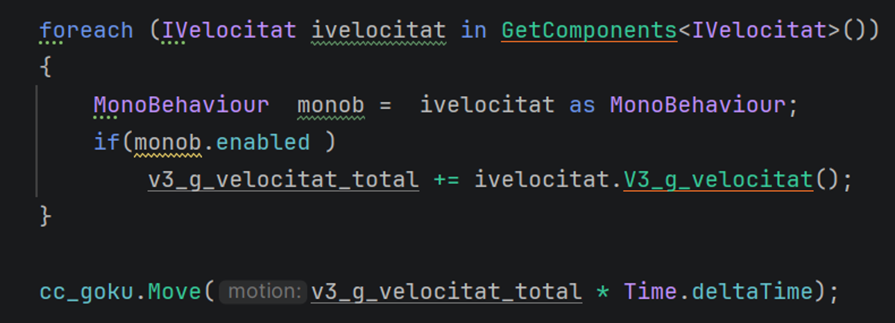

El sistema de salto combina un **impulso inicial** con la aplicación continua de la **gravedad**, logrando un comportamiento natural y controlado. Para **evitar errores de colisiones con el SphereCast en superficies inclinadas**, se ha incorporado un pequeño **margen temporal (_grace time_) que impide que la velocidad vertical se reinicie de forma prematura e inesperada al iniciar el salto** (esto ocurre porque en una rampa la esfera chocaría con la rampa y se reiniciaría la velocidad, provocando que el personaje no salte).

En cuanto a los controles, casi todo el sistema de entrada del personaje se ha desarrollado utilizando el **nuevo Input System de Unity**. Esto permite gestionar de forma unificada los controles de **teclado, mando y dispositivos táctiles**, facilitando la detección automática del dispositivo de entrada y adaptando el comportamiento del personaje en función de este.

El uso del nuevo Input System aporta numerosas ventajas al proyecto, como una mejor escalabilidad multiplataforma, un código más limpio y desacoplado, y una gestión del input basada en eventos de Unity.

Gracias a ello, **el sistema de sprint presenta comportamientos distintos según el dispositivo utilizado, permitiendo mantener pulsada la tecla en teclado, alternar el estado en mando o activar el sprint de forma automática en dispositivos móviles cuando se detecta desplazamiento hacia delante.**

En conjunto, este sistema de control y movimiento proporciona una experiencia fluida, coherente y adaptable a distintas plataformas, cumpliendo los requisitos de un **videojuego multiplataforma moderno**.

---

### 4.1.2 Sistema de manejo y disparo de la escopeta

El sistema de manejo y disparo de la escopeta lo he implementado siguiendo un enfoque modular, separando la lógica del arma de la del personaje, lo que permite un control más flexible y escalable. Para ello, he desarrollado un **script principal para la escopeta (`ShotgunController`)** que gestiona todas las mecánicas propias del arma, y un **script de control del jugador (`Dispar`)** que actúa **como intermediario entre el jugador y el arma equipada.**

El script de la escopeta se encarga de todas las funcionalidades relacionadas con el arma en sí, incluyendo **recogerla, apuntar, disparar, soltarla y mostrar información visual al jugador**. También gestiona las características propias del arma, como el **número de proyectiles, la dispersión, el daño por perdigón y la cadencia de disparo**. Estas propiedades pueden **actualizarse dinámicamente, permitiendo que mejoras o modificaciones del jugador se reflejen automáticamente en el comportamiento del arma.**

El script de control del jugador detecta armas cercanas mediante **colisiones trigger (no colisiona físicamente, detecta que está al alcance)** y gestiona las acciones de interacción, como recoger o soltar el arma, apuntar y disparar. La comunicación entre ambos sistemas se realiza mediante la **interfaz `IArma`**, lo que asegura que cualquier tipo de arma pueda integrarse en el mismo sistema sin necesidad de modificar el código del jugador. Además, utilizo inputs adaptativos para distintos dispositivos (teclado, mando y pantalla táctil), garantizando que el jugador pueda apuntar y disparar de manera intuitiva en cualquier plataforma.

El disparo de la escopeta combina la generación de **múltiples proyectiles con dispersión aleatoria, simulando el comportamiento realista de una escopeta de 8 perdigones**. **Cada proyectil realiza una comprobación de colisión** **para detectar impactos en enemigos u objetos del entorno, aplicando daño de forma individual según las características del arma**. La cadencia limita la velocidad de disparo, asegurando un ritmo controlado y equilibrado en el juego.

**El apuntado se gestiona mediante una transición de la cámara a una posición específica definida en la escena**, esto le proporciona al jugador una sensación de precisión y control.

Además, he incluido un sistema visual que indica cuándo el arma puede ser recogida o está equipada, mejorando la claridad de la interfaz y la inmersión. Esto lo hago con **un texto encima del arma que dice "Coger (E)", y un botón interactivo en el caso de pantallas táctiles.**

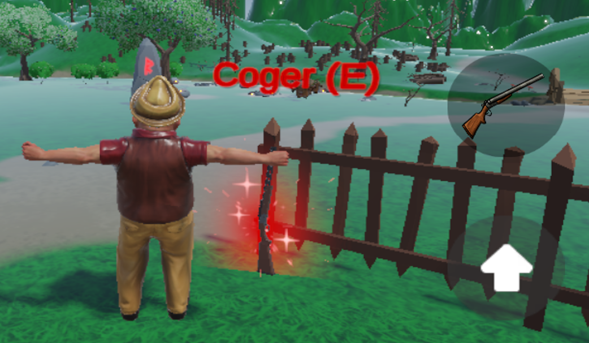

Gracias a esta arquitectura modular, el sistema de manejo y disparo de la escopeta permite implementar **mecánicas complejas de interacción y combate con los enemigos**, generando situaciones realistas y complejas como, por ejemplo, **cuando impactas en un enemigo, dependiendo de qué tan bien le hayas dado puedes quitar más o menos vida según los perdigones que le hayan impactado.**

> **Imagen de un impacto mal dado con la escopeta (las líneas verdes representan los perdigones)**

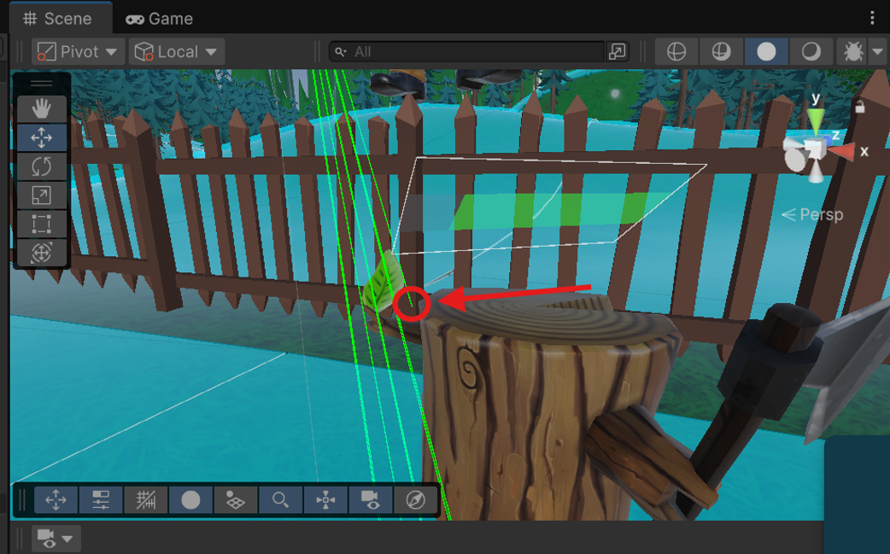

> **Vista del disparo desde juego en el móvil**

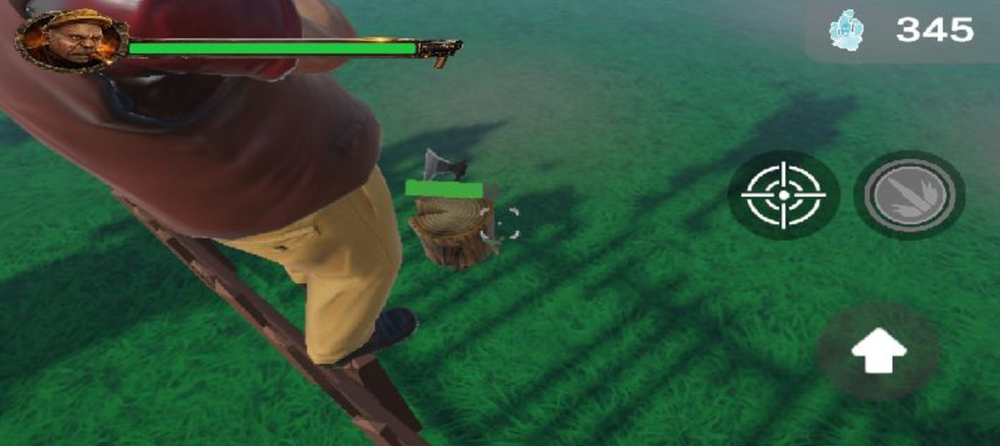

También he establecido el **alcance de los perdigones de la escopeta**, he podido hacer todo tipo de pruebas con el sistema de disparo **haciendo Debug con DrawLine del Raycast de cada perdigón.**

> **Imagen donde observamos los perdigones que impactan con la valla (verde) y los que no impactan con nada y llegan a su límite de alcance (rojo).**

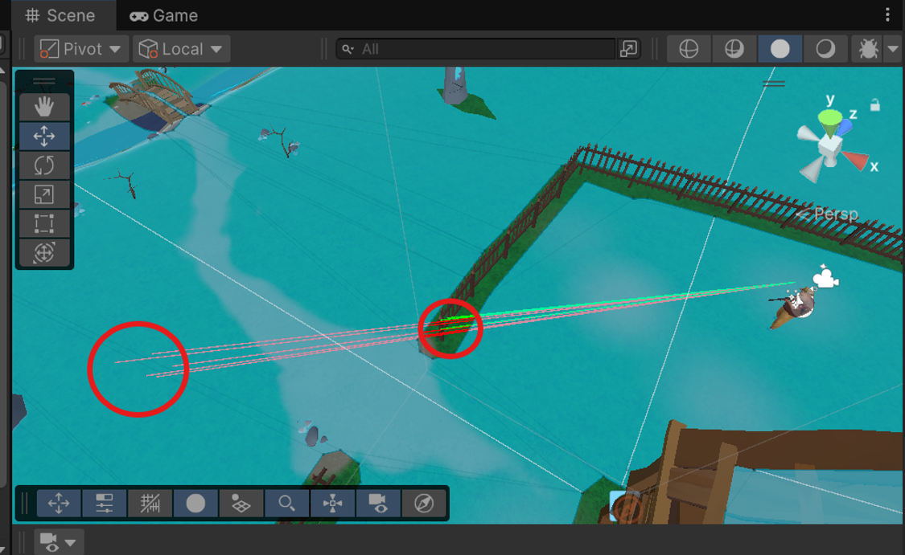

A continuación, explico cómo funciona más detalladamente la interacción con los enemigos.

---

### 4.1.3 Gestión de enemigos con distintos comportamientos

El sistema de enemigos se ha diseñado de manera modular y jerárquica, utilizando **una clase padre abstracta `Enemigo`** de la que **heredan todos los tipos de enemigos del juego**. Esto permite centralizar la gestión de atributos comunes, como la vida, la barra de salud y la muerte, mientras que cada enemigo tiene sus propios scripts específicos con los que puede implementar su propio comportamiento y reacciones específicas ante los ataques del jugador.

Por ejemplo, **los AngryLogs pueden bloquear los disparos con su hacha dependiendo de la orientación del impacto,** mientras **que los osos (`Bear`) poseen un collider en la cabeza que multiplica el daño del perdigón x2 en caso de un headshot.**

También tienen la posibilidad de **heredar un método de efecto especial**; este por ejemplo lo uso en **los AngryLogs Boss para generar el área de curación cuando mueren**, esta dura 20 segundos y cura 2 de vida/s.

> **AngryLog Boss y su área de curación especial al morir**

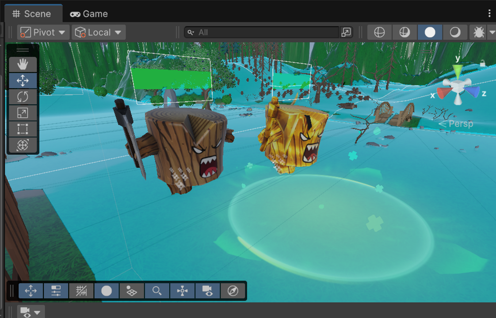

**Todos los enemigos poseen un sistema de vida con barra visual (`Enemy_HealthBar`)** que se actualiza en tiempo real con una transición suave y degradado de color.

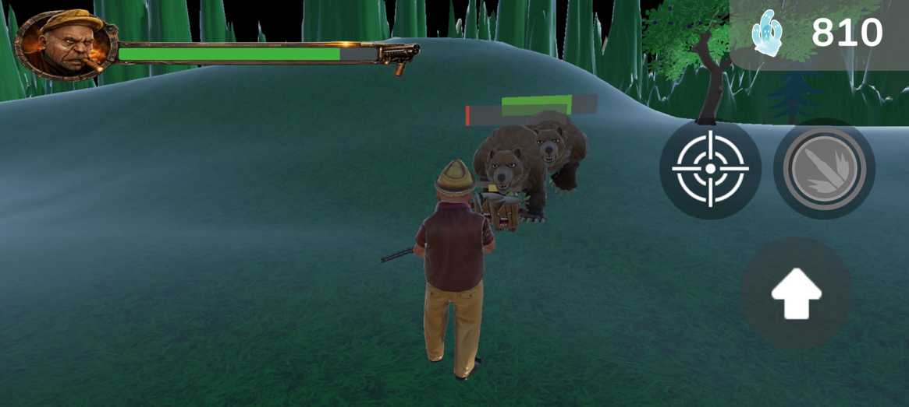

#### Movimiento de los enemigos y persecución del jugador

Para permitir un movimiento autónomo y realista, todos los enemigos persiguen al jugador utilizando el **componente `NavMeshAgent`**. Este sistema permite que los enemigos calculen rutas de forma automática evitando obstáculos, terrenos irregulares y otros elementos del escenario. Cada actualización, el enemigo establece la posición del jugador como destino, ajustando su velocidad y dirección de forma fluida. Además, los osos cuentan con un **script controlador de animaciones (`Bear_AnimController`)** que **sincroniza la velocidad del `NavMeshAgent` con los parámetros del `Animator`** y gestiona la ejecución de ataques en función del tiempo y la distancia al jugador.

> **Animator del oso. Establecemos una animación u otra dependiendo de los valores de los parámetros que editamos por código (animación de correr cuando 'speed' es mayor a 2.5)**

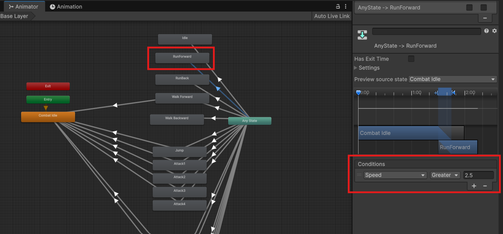

> **Lógica y cooldown que controlan las animaciones de los ataques del oso, dando lugar a que cuando está a la distancia adecuada, se frena y ejecuta un ataque aleatorio de los 4 que tiene cada 1.5 segundos.**

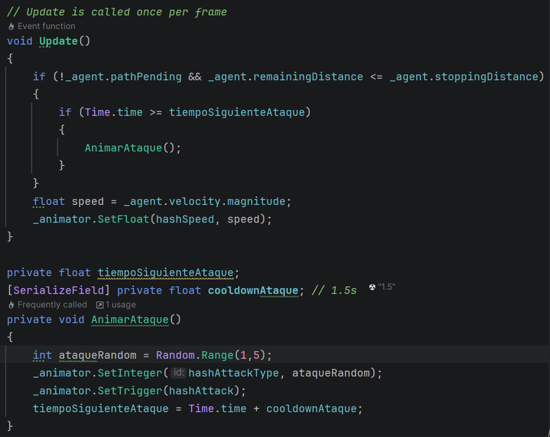

#### Sistema de ataque de los enemigos

El sistema de ataque viene determinado por varios colliders marcados como triggers, los cuales hacen una cantidad específica de daño al jugador cuando entra en ellos.

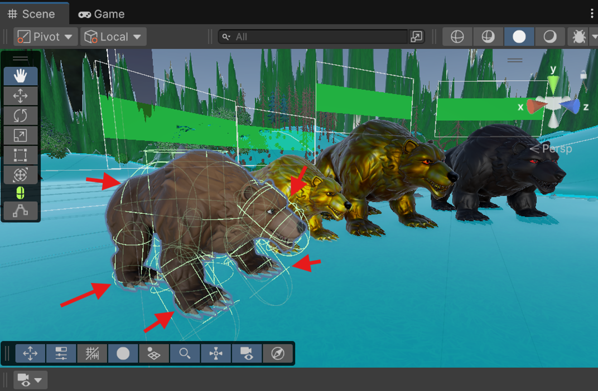

Cada objeto que posee el componente del **collider trigger** tiene asociado el script que hace **que si lo que ha entrado es el jugador, este recibe daño** (la cantidad que se le haya establecido desde el inspector de Unity):

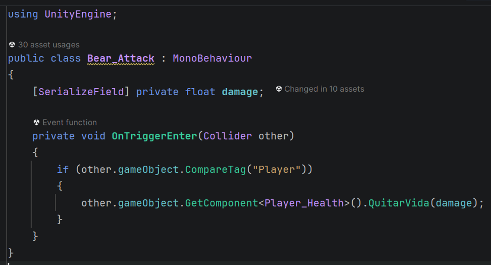

---

### 4.1.4 Sistema de oleadas, curva de dificultad y economía del juego

Tanto el sistema de oleadas como la economía del juego afectan a su curva de dificultad.

#### Sistema de oleadas

He diseñado el sistema de oleadas para gestionar de forma progresiva la aparición de enemigos y ajustar la dificultad del juego a medida que avanza el jugador. Cada oleada se genera automáticamente cuando no quedan enemigos vivos, con un pequeño temporizador que establece un breve intervalo entre ellas y permite al jugador prepararse antes del siguiente enfrentamiento (esto el jugador lo agradece mucho cuando necesita tiempo para curarse).

La dificultad de cada oleada se calcula **mediante un presupuesto de "puntos de dificultad"** que aumenta con el número de oleada, lo hace de manera mixta (lineal y parte exponencial).

puntosDificultad = oleadaActual x  3 + [oleadaActual ^ 1.5]

Estos puntos determinan qué tipo y cuántos enemigos se generarán, incluyendo **versiones especiales doradas que otorgan x10 veces la recompensa habitual de almas (la moneda del juego)**, introduciendo un elemento de aleatoriedad y recompensa adicional. Los enemigos más poderosos se spawnean en oleadas más avanzadas y cuestan más puntos de dificultad de la oleada, además tienen un factor aleatorio también que se incluye en la condición, asegurando un escalado de dificultad gradual y equilibrado.

> **Fragmento de código que decide qué enemigo soltar, depende de 3 variables principales:**
> *Random del 1 al 10, número de oleada y presupuesto actual de la oleada.*
> *1% de probabilidad de versión dorada.*

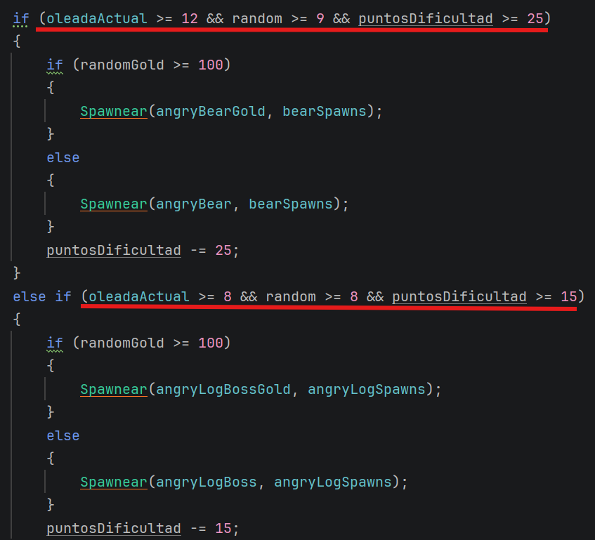

Los enemigos vivos se registran y actualizo el contador automáticamente mediante eventos (`OnEnemigoMuerto`), de esta manera cuando llega a 0 generamos una nueva oleada. Además, proporciono feedback visual al jugador a través de mensajes de "Oleada X", que se muestran en pantalla al inicio de cada oleada.

También he establecido que **cuando un jugador empieza una nueva partida no siempre empiece en la primera oleada**, ya que esto puede ser un poco aburrido o frustrante el tener que empezar de 0 si mueres, por lo que he decidido hacer que **la primera oleada será el nivel de la escopeta / 2.**

Esta información **está guardada en local en el juego del usuario** que más adelante en el apartado de Acceso a Datos muestro cómo funciona.

#### Economía del juego

La economía del juego está diseñada para mantener al jugador enganchado mediante recompensas calculadas y un escalado progresivo en las mejoras de la escopeta en el menú principal.

Cada enemigo otorga una cantidad concreta de almas al morir, y sus versiones doradas multiplican la recompensa por 10.

| Enemigo         | Almas base | Versión dorada |
|-----------------|------------|----------------|
| AngryLog        | 10         | 100            |
| AngryLogBoss    | 25         | 250            |
| Bear            | 50         | 500            |
| AngryBear       | 75         | 750            |

> **Todos los enemigos del juego, modelos 3D sacados de Unity Asset Store. Las texturas doradas sí que han sido desarrolladas por mí.**

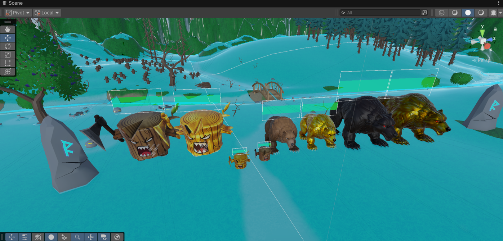

Las mejoras de la escopeta en el menú aumentan su coste de manera exponencial, multiplicando el precio del nivel anterior por 1,25, empezando en 150.

He considerado que esta era la mejor manera de hacerlo, ya que, gracias a esta arquitectura, el juego mantiene un ritmo constante de desafío, adaptándose a la progresión del jugador y garantizando una experiencia fluida y dinámica durante toda la partida.

---

## 4.2 Desarrollo de Interfaces

He diseñado y desarrollado una interfaz gráfica completa y funcional, cuidando especialmente la usabilidad y la claridad visual.

### 4.2.1 Menú principal con botones interactivos

Este menú actúa como punto central de interacción antes de la partida, ambientado con música épica de la temática y compuesto por un botón principal de inicio de juego, claramente destacado para guiar al jugador de forma natural a la acción de entrar en partida.

Además, el menú principal incluye un panel de mejora de la escopeta, desde el cual el jugador puede gestionar la progresión de su arma. En este panel se muestran de forma clara todas las estadísticas relevantes de la escopeta, la cantidad de almas disponibles y el coste de la siguiente mejora. El botón de mejora ofrece feedback visual y sonoro, indicando tanto las mejoras realizadas con éxito como los intentos fallidos cuando el jugador no dispone de suficientes recursos, reforzando así la sensación de respuesta y control.

> **Menú principal del juego.**

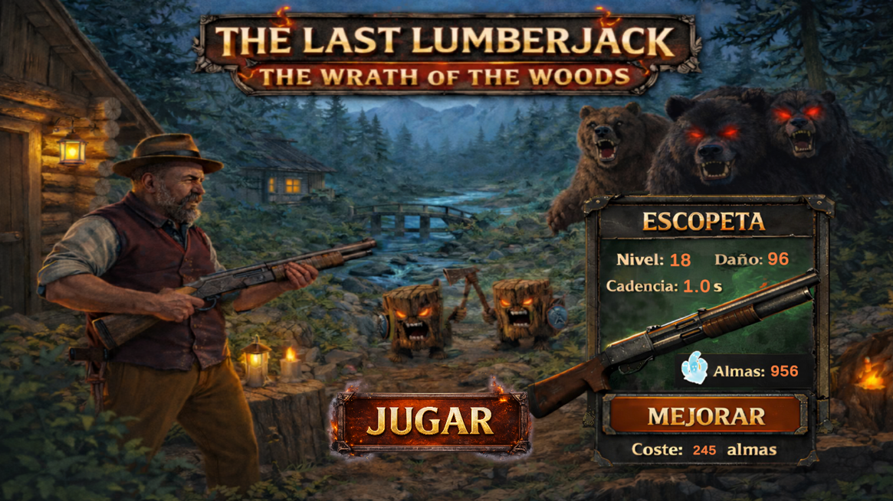

### 4.2.2 Interfaz durante la partida

La interfaz durante la partida se ha diseñado para ofrecer al jugador información clara y relevante en todo momento, sin sobrecargar la pantalla ni interferir en la acción. Todos los elementos visuales se integran de forma coherente con la estética del juego y están pensados para ser interpretados con un simple vistazo rápido.

El jugador dispone de una barra de vida animada, acompañada de un marco visual tematizado que refuerza su presencia en pantalla. Esta barra incluye un degradado de color que varía dinámicamente en función de la vida restante, facilitando la identificación del estado de salud del personaje.

Durante el transcurso de la partida, cada nueva oleada se anuncia mediante un texto informativo en el centro de la pantalla *"Oleada X"*, que aparece al inicio de esta. Este elemento proporciona un feedback claro sobre la progresión de la partida y refuerza la sensación de avance y aumento de dificultad.

En la parte superior derecha de la interfaz muestro un contador de almas en tiempo real, esto permite al jugador conocer en todo momento la cantidad de recursos disponibles. Este contador refuerza el sistema de recompensas, ayudando al jugador a identificar qué enemigos aportan mayor beneficio y a planificar las mejoras de la escopeta de forma estratégica.

Cuando el personaje entra en modo apuntar encontramos también la imagen de la mira de la escopeta, esta reflejará el área donde impactarán los perdigones.

> **Elementos clave de UI/UX en partida.**

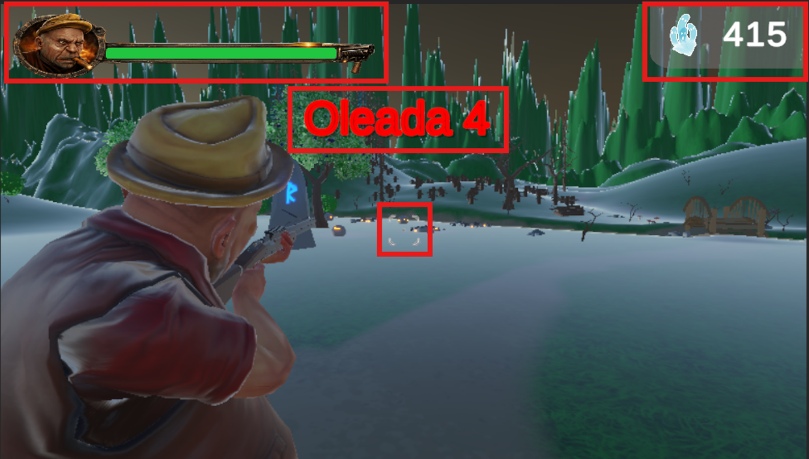 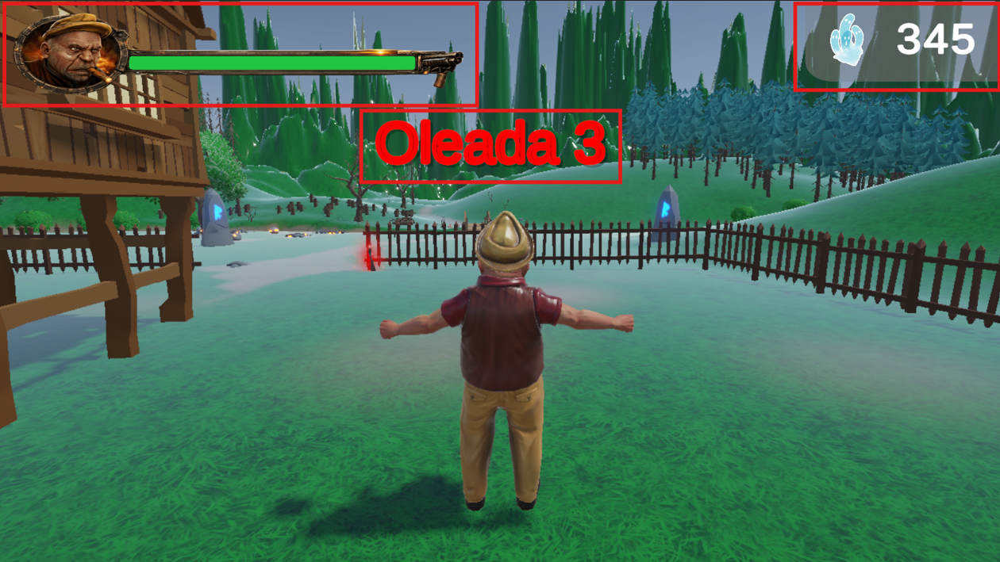

### 4.2.3 Controles táctiles para dispositivos móviles

Para los dispositivos con pantalla táctil, se ha diseñado un sistema de **controles táctiles en pantalla**, pensado específicamente para ofrecer una experiencia cómoda y precisa en un videojuego de acción en tercera persona. Estos controles se integran directamente en la interfaz durante la partida y se adaptan visualmente al estilo del juego sin resultar intrusivos.

En la parte izquierda de la pantalla se muestra un **joystick virtual de movimiento**, que permite al jugador desplazarse libremente por el escenario; es **un joystick dinámico el cual solo se muestra cuando el jugador toca la pantalla para moverse y se mueve con el dedo del jugador**, de manera que queda **la interfaz más minimalista y limpia sin dejar de ser intuitiva.**

En la parte derecha se sitúan los **controles de acción**, entre los que se incluyen **los botones de saltar, el de coger la escopeta cuando está al alcance, y los de apuntar y disparar (solo disponibles con la escopeta)**. Todos los controles de acción están **colocados estratégicamente para poder ser utilizados con el pulgar sin necesidad de soltar el control de movimiento.**

Su **diseño visual es claro, reconocible y coherente con el resto de la interfaz**, utilizando iconos intuitivos que no requieren ningún aprendizaje previo.

Gracias a este sistema, el jugador puede **moverse, apuntar y disparar de forma simultánea**, lo que resulta esencial en un juego de este tipo.

Detalles de los controles táctiles disponibles:

| Control | Ubicación | Función | Disponibilidad |
|---------|-----------|---------|-----------------|
| **Joystick de movimiento** | Parte inferior izquierda | Desplazamiento del personaje en todas direcciones | Siempre activo |
| **Botón Saltar** | Parte inferior derecha inferior | Permite al personaje saltar | Siempre disponible |
| **Botón Coger** | Parte derecha central | Recoge la escopeta | Solo cuando hay escopeta cerca |
| **Botón Apuntar** | Parte central derecha | Activa el modo apuntado de la escopeta | Solo con escopeta equipada |
| **Botón Disparar** | Parte central derecha | Dispara los perdigones de la escopeta | Solo en modo apuntado |

Esta adaptación de los controles a pantallas táctiles garantiza una experiencia fluida y jugable, manteniendo la dificultad y el ritmo del juego sin penalizar al usuario.

> **Personaje cerca de la escopeta**

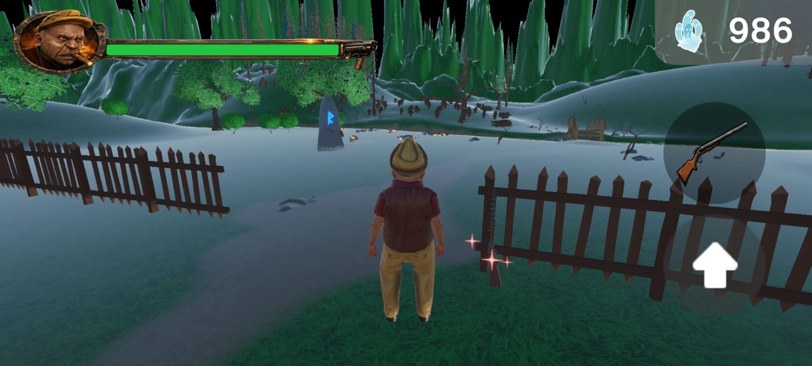

> **Personaje con la escopeta**

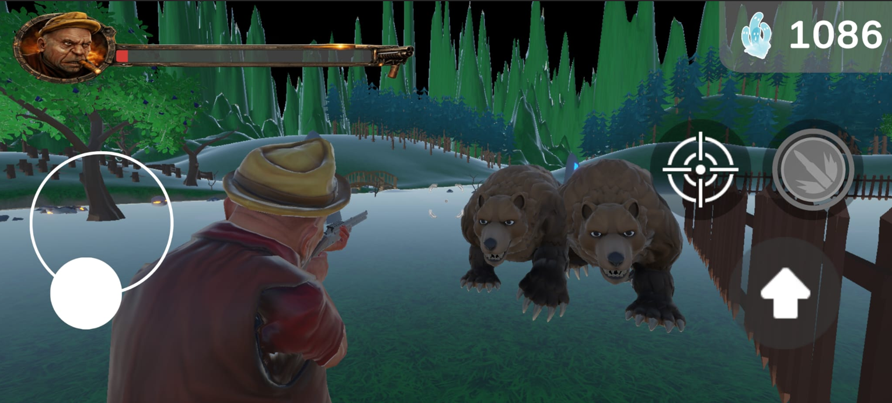
---

## 4.3 Acceso a Datos

Aunque no utilizo bases de datos tradicionales ni ficheros externos, el proyecto sí implementa **persistencia de datos**, lo cual es un concepto fundamental del módulo de Acceso a Datos.

Esta persistencia permite conservar información del jugador en local, guardándose entre distintas sesiones de juego, evitando que el progreso se pierda al cerrar la aplicación.

He utilizado la tecnología **`PlayerPrefs` de Unity**, un sistema integrado que **permite almacenar pares clave-valor** **de forma persistente en local en el dispositivo del usuario**. `PlayerPrefs` guarda los datos de manera automática en el sistema operativo correspondiente (registro en Windows, archivos internos en Android, etc.), lo que lo convierte en una solución sencilla y eficaz para proyectos de este tipo.

- Progreso de las estadísticas y mejoras de la escopeta del jugador (nivel, daño, cadencia).
- Moneda acumulada (almas y coste de mejora).

Estos datos se gestionan en el proyecto **mediante métodos _getters_ y _setters_** , garantizando un acceso controlado y seguro a la información almacenada.

> **Script que inicializa los datos almacenados y contiene el método que guarda el progreso.**
> *Cada vez que se suman o restan almas se guardan los datos.*

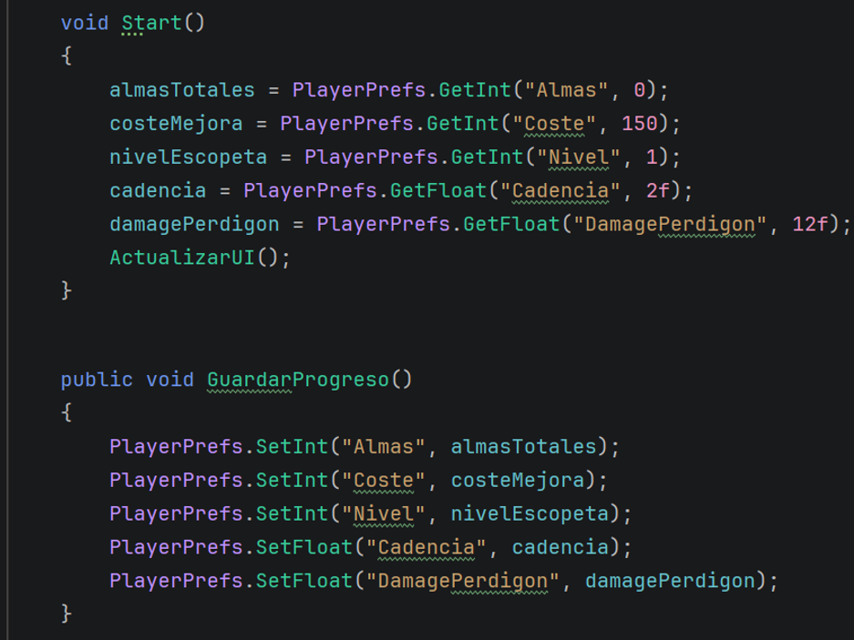

---

## 4.4 Sostenibilidad

El videojuego tiene un mensaje indirecto de concienciación medioambiental a través de su narrativa.

La historia refleja las consecuencias de la explotación excesiva del entorno natural, representando al bosque como una entidad viva que reacciona ante el daño que ha sufrido o que 'Paco' (el personaje) le ha causado.

Dando lugar así al nombre del videojuego: **_The Last Lumberjack_ (El último leñador)** .

Con este enfoque uso en el proyecto valores de sostenibilidad de forma indirecta, utilizando el medio interactivo como herramienta.

---

## 4.5 Programación de Servicios y Procesos

Aunque _The Last Lumberjack_ no es un servicio cliente-servidor tradicional, durante su desarrollo he aplicado varios conceptos trabajados en la asignatura de Programación de Servicios y Procesos, especialmente relacionados con la ejecución concurrente de tareas y la gestión de distintos procesos dentro de una aplicación.

Durante la ejecución del videojuego, varios sistemas funcionan al mismo tiempo. Por ejemplo, **mientras el jugador se mueve y dispara, el juego está calculando las colisiones, ejecutando la inteligencia artificial de los enemigos, controlando el sistema de oleadas y actualizando la interfaz gráfica.** Todos estos sistemas se ejecutan de forma simultánea y **deben estar correctamente coordinados para que el juego funcione de manera fluida**, lo que está directamente relacionado con la concurrencia y la gestión de procesos.

El juego debe **gestionar correctamente las ejecuciones de todos los scripts (muchos)** y en muchas situaciones hay que **controlar el estado de los objetos** para **evitar errores, avisos, o cualquier comportamiento incorrecto.**

Además, el videojuego incluye un sistema de persistencia de datos, encargado de guardar y cargar información como el progreso del jugador o las configuraciones del juego. Estas operaciones se realizan sin interrumpir la ejecución principal del juego, lo que implica una correcta gestión de procesos de entrada y salida para no bloquear la aplicación.

También, por ejemplo, el juego gestiona distintos estados como el menú principal, la partida activa, el final de la partida; en cada uno de estos estados se activan o desactivan diferentes procesos y elementos del juego.

En conclusión, **_The Last Lumberjack_** aplica de forma práctica los conceptos de Programación de Servicios y Procesos, especialmente en la gestión de procesos independientes y la coordinación entre distintos sistemas dentro de una aplicación interactiva en tiempo real.

---

# 5. Desarrollo de una web para el videojuego

Con el objetivo de complementar el videojuego **_The Last Lumberjack_**, he desarrollado una web landing oficial para presentar el videojuego y que se pueda descargar directamente desde esta.

La idea no era simplemente diseñar una página estática, sino crear un **punto central desde el cual cualquier usuario pueda conocer el juego y descargarlo fácilmente** en sus distintas versiones. Aquí aprovecho para presentar y desarrollar la historia del videojuego. De esta manera, el juego adquiere una presentación más profesional, realista y se convierte en un producto más completo.

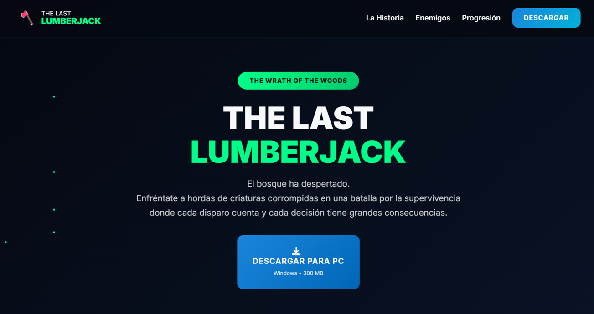

## 5.1 Tecnologías utilizadas

**El desarrollo de esta web tiene mucha relación con el módulo de Desarrollo de Interfaces debido a las tecnologías que he usado.**

La web ha sido desarrollada utilizando:

- **HTML5**, para estructurar el contenido.
- **SCSS**, para la gestión avanzada y organizada de estilos.
- **JavaScript**, para añadir interactividad y mejorar la experiencia de usuario.

El uso de SCSS ha sido especialmente intensivo, para darle un aspecto único y acorde a la temática del juego. He organizado los estilos mediante **variables, anidamiento (nesting) y todo dividido por secciones y de forma modular**, esto me ha permitido mantener un **código más limpio y escalable**.

En cuanto a JavaScript, implementé funcionalidades concretas como:

- **Scroll suave entre secciones.**
- **Menú hamburguesa responsive** que se abre y se cierra en dispositivos móviles.
- Conocer el dispositivo para ofrecer la **versión del juego indicada (apk, zip)** en el **hero (primera sección destacada)** .

Estas mejoras no eran obligatorias para la descarga del juego, pero aportan una **experiencia de usuario más moderna y profesional** en la web.

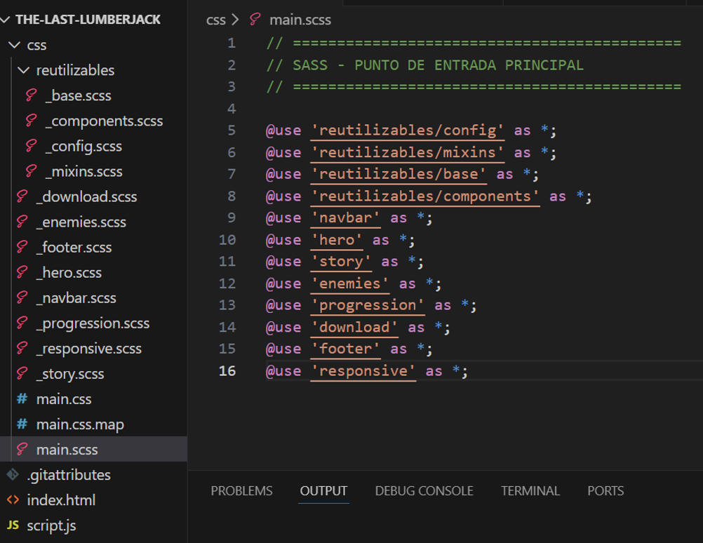

## 5.2 Problema con los archivos del juego y la solución

Uno de los principales retos técnicos fue permitir la descarga del juego desde la web. Tanto el archivo ejecutable (.exe) como el archivo Android (.apk) **superaban los 100 MB, lo que impide subirlos directamente al repositorio estándar de GitHub.**

Al principio probé a utilizar **Git LFS (Large File Storage)**. Sin embargo, no funcionó porque **Git LFS no almacena el archivo binario directamente**, sino que **guarda un puntero al archivo real**. Al enlazar ese archivo mediante un href en la web, la descarga no funcionaba correctamente, ya que el enlace apuntaba al puntero y no al ejecutable final.

La solución definitiva fue utilizar **GitHub Releases**. Este sistema permite asociar archivos grandes a una versión concreta del proyecto y generar un enlace de descarga directa.

El proceso seguido fue:

1. Crear una nueva release vinculada a una versión del videojuego.
2. Subir como "assets" los archivos:
   - Versión Windows (.zip con el .exe y lo necesario)
   - Versión Android (.apk)
3. Obtener el enlace de descarga generado automáticamente por GitHub.
4. Integrar dicho enlace en los botones de descarga de la web.

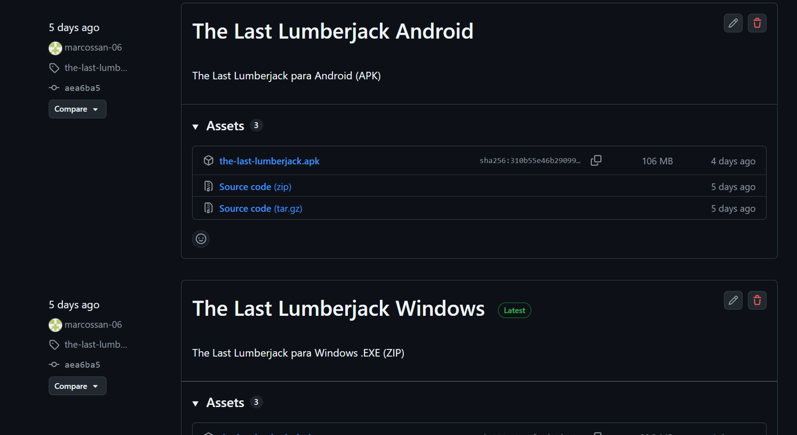

**Gracias a esta solución, los usuarios pueden descargar el archivo real sin problemas.**

## 5.3 Integración con Cloud y despliegue

Para complementar la web de **_The Last Lumberjack_** y **aplicar los conocimientos del módulo de Cloud**, he realizado el despliegue de la página web a un **entorno de producción real en Vercel**, una plataforma de hosting que, aunque abstrae la infraestructura, **por detrás lo que hay son los servicios cloud de AWS**.

Para llevarlo a cabo, conecté el repositorio de GitHub con Vercel y se habilita el despliegue automático. De esta manera, **cada push al repositorio de GitHub genera una nueva versión de la web disponible online bajo un dominio gratuito vercel.app.**

Así se mantiene la página siempre **actualizada sin intervención manual, reproduciendo un flujo de [CI/CD (Continuous Integration / Continuous Delivery)](https://aws.amazon.com/es/what-is/ci-cd/).**

Como resultado final tenemos una web **completamente accesible desde cualquier dispositivo**, **sincronizada con el proyecto en GitHub**, combinando desarrollo frontend con conceptos de cloud computing y despliegue automatizado.

**🌐 WEB: [Landing Page The Last Lumberjack](https://thelastlumberjack.vercel.app/)**

---

# 6. Metodología de trabajo y gestión del proyecto

Durante el desarrollo de _The Last Lumberjack_ he seguido una metodología de trabajo adaptada al contexto de un proyecto individual y al desarrollo de un producto de software interactivo como es un videojuego. Esta metodología me ha permitido **avanzar de forma progresiva, asegurando en todo momento que el proyecto se mantuviera funcional y estable**.

He estructurado el desarrollo en distintas fases, **sin la necesidad estricta de cumplirlas de forma rígida, sino adaptándolas según las prioridades del proyecto**. Comencé por la implementación de las mecánicas básicas del juego, como el movimiento del personaje en tercera persona y el sistema de disparo. Una vez estas mecánicas estuvieron correctamente implementadas, pasé a desarrollar otros sistemas como la inteligencia básica de los enemigos, el sistema de oleadas, la interfaz y el menú para el usuario, y la persistencia de datos.

Después de cada avance relevante realizo pruebas de funcionalidad para verificar que el juego sigue siendo jugable y que las nuevas funcionalidades no generan errores colaterales (algo que suele pasar). De esta manera consigo detectar los problemas cuanto antes y corregirlos antes de continuar con el desarrollo.

En cuanto al control de versiones, debido a varios problemas y a la falta de practicidad que me suponía utilizar el control de versiones de la nube de Unity, opté por una solución alternativa durante el desarrollo del videojuego.

Realicé copias de seguridad periódicas del proyecto, **manteniendo siempre dos respaldos: uno en una carpeta diferente dentro del portátil y otro en un dispositivo externo (pendrive).** De esta manera he asegurado la integridad del proyecto y he recuperado versiones anteriores en caso de errores graves.

Por el contrario, **en el desarrollo de la parte web del proyecto sí he utilizado Git como sistema de control de versiones**, ya que en este contexto su funcionamiento era más estable, permitiéndome gestionar los cambios de forma más eficiente y organizada.

Para la gestión diaria del proyecto utilizo un sistema personal de seguimiento basado en notas digitales, que me resulta práctico y eficiente. En estas notas registro:

- Incidencias detectadas durante el desarrollo.
- Ideas de mejora o ampliación del videojuego.
- Tareas pendientes organizadas por prioridad.

Gracias a este sistema puedo retomar el desarrollo con facilidad tras cada sesión de trabajo y mantener una visión global del estado del proyecto.

---

# 7. Seguimiento, control y evaluación del proyecto

Para garantizar el correcto desarrollo del proyecto y la calidad del videojuego final, he establecido un sistema de seguimiento, control y evaluación basado en una serie de variables e indicadores de calidad directamente relacionados con los objetivos iniciales del proyecto y los requisitos del proyecto intermodular.

Las principales variables e indicadores utilizados son:

- **Rendimiento técnico del videojuego**, evaluado principalmente mediante la estabilidad de los fotogramas por segundo (FPS).
- **Persistencia de los datos del jugador**, asegurando que el progreso se guarde.
- **Experiencia de usuario (UX)**, valorando la claridad de la interfaz y la facilidad de uso de los controles.

El control del rendimiento técnico se realiza mediante **pruebas periódicas en las diferentes plataformas soportadas**, prestando especial **atención a dispositivos móviles de gama media**. El objetivo es mantener una tasa de rendimiento estable cercana a los **40--60 FPS**, garantizando una experiencia fluida sin comprometer la calidad visual.

La persistencia de los datos se evalúa **comprobando que el sistema de guardado se ejecuta correctamente tras acciones clave del jugador**, como la eliminación de enemigos o la obtención de la moneda del juego (almas). Además, se realizan múltiples pruebas de cierre y reapertura del videojuego para verificar que los datos almacenados se cargan correctamente en todo momento.

La experiencia de usuario se analiza observando la interacción del jugador con los menús, los controles y los elementos visuales, identificando posibles puntos de confusión o dificultad. Cada nueva mecánica implementada se prueba en las tres plataformas principales: **PC (teclado y ratón), mando y dispositivos móviles con controles táctiles**, con el objetivo de asegurar una experiencia coherente independientemente del sistema de control que se utilice.

En el caso de la interfaz gráfica, evalúo si el jugador es capaz de navegar por los menús y comprender las opciones disponibles sin necesidad de instrucciones adicionales. Para los controles táctiles, se comprueba que los botones sean visibles, accesibles y cómodos de utilizar en pantallas de distintos tamaños.

---

# 8. Gestión y resolución de incidencias

Durante el desarrollo del videojuego se han presentado diversas incidencias, tanto a nivel técnico como de diseño. Algunas de ellas me provocaron tener que volver a una copia de seguridad anterior.

Para gestionar estas incidencias sigo un procedimiento estructurado que me permite abordarlas de forma eficiente.

En primer lugar, registro cada incidencia detectada en mis notas personales, indicando una breve descripción del problema y la plataforma en la que se produce. Posteriormente analizo el flujo del código relacionado con la incidencia, revisando tanto los scripts implicados como los ajustes de Unity.

Para localizar el origen del error utilizo herramientas de depuración como mensajes de registro en consola (_debug logs_), que me permiten identificar la línea exacta de código que provoca el fallo. Una vez localizado el problema, priorizo la resolución de aquellas incidencias que bloquean el progreso del jugador o afectan gravemente al rendimiento.

En los casos en los que la incidencia está relacionada con el rendimiento, realizo tareas de optimización, como la mejora de scripts, la reducción de cálculos innecesarios o la optimización de modelos y recursos gráficos.

---

# 9. Evaluación por parte de usuarios

Durante el desarrollo del videojuego he contado con la participación de usuarios externos para obtener feedback. Familiares de todas las edades, amigos y compañeros han probado distintas versiones del juego, permitiéndome evaluar:

- **La comprensión de las mecánicas.**
- **La claridad de los controles.**
- **El nivel de diversión y dificultad.**

Este feedback ha sido especialmente útil para ajustar los controles táctiles y equilibrar la dificultad del juego.

---

# 10. Conclusiones

Considero que el desarrollo de **_The Last Lumberjack_** ha supuesto una experiencia de aprendizaje durante el curso muy completa. He podido aplicar conocimientos técnicos del ciclo, aprender nuevas tecnologías y enfrentarme a problemas reales del desarrollo de software y el despliegue de un proyecto desde 0 hasta el final.

Considero que el proyecto cumple los objetivos planteados inicialmente y demuestra la adquisición de competencias propias del ciclo formativo.
